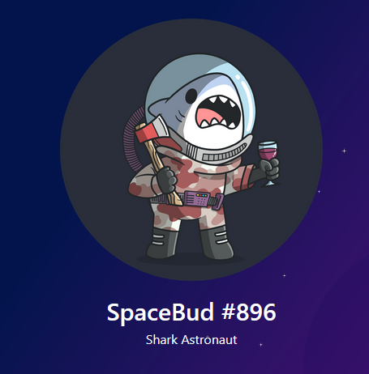
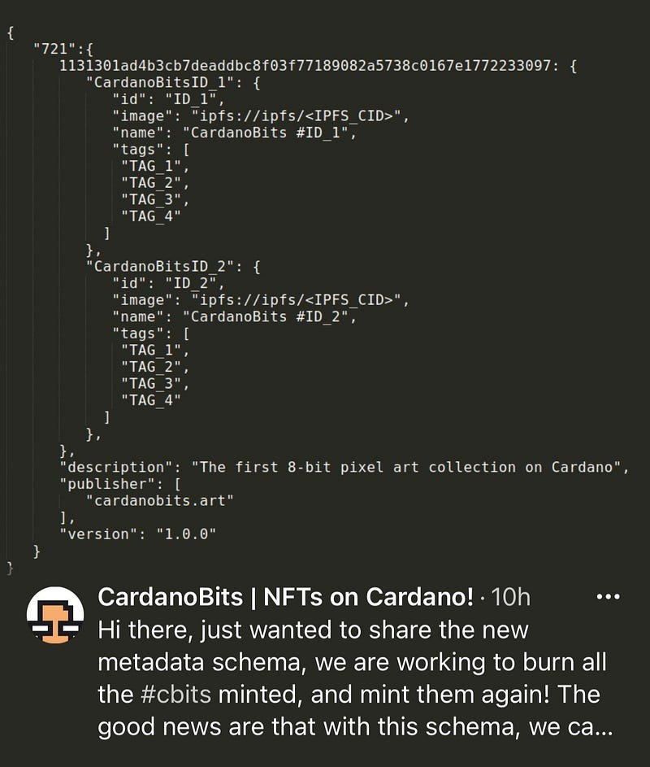

NFTs in Cardano — an Etherum alternative already?

NFTs are currently the hype if you float around the cardano universe. With the recent launch of SpaceBudz and
CardanoBits many more are…
<!--more-->
### NFTs in Cardano — the current state
NFTs are currently the hype if you float around the cardano universe. With the recent launch of SpaceBudz and CardanoBits many more are preparing to launch their own, custom NFTs in the Cardanosphere.

That in itself is quite impressive because if you follow the Cardano Project a bit you might be aware that there are currently **no** smart contracts availiable. But with a few clever ideas it’s possible to “mint” NFTs on the Cardano blockchain.

With this article I want to provide an behind and what to be aware of if you want to buy NFTs. Let’s go.

### How it works

The current “gold standard” was set by the creators of <a href="https://spacebudz.io/" data-href="https://spacebudz.io/">SpaceBudz</a>. 

In Cardano a native asset / token get’s minted by issuing a “minting”-transaction — just like sending ADA from one wallet to another.
Every token is associated with a unique minting policy. Important Metadata such as the name, id or image URL can be added to this *minting transaction under a speficic label.*
Third party plattforms like pool.pm can now query the transaction, read the attached metadata and properly display the images.

### “Problems”

#### No standard metadata label

In order for 3rd party tools like pool.pm to query the metadata, those tools must know where to look.
Obviously you say the metadata — but currently there is no standarad as to *how to structure and label* that      metadata.

A simple example:
SpaceBudz categorized their metadata with the label “721”. For a 3rd party tool the query would look like:
“Look up transaction X and check the metadata for label ‘721’. In there you will find the image url."

If another supplier of NFTs would label their metadata under a different label like “myownbadasslabel”, no 3rd party tool would be know to look under that exact word.
My guess and recommendation is — if you want to mint your own NFTs and distribute them: please follow that standard. Even though it’s not “officially” recognized, doing it that way is the best way to have it one day be the official standard.

#### (Pre-)Sale

What we’ve seen so far is, that pre-sales always implement some sort of “hacky” workaround as there are no smart contracts. And hacky does not mean bad, rather being handled off-chain.

The main problems are the following:
- Minting a large amount of unique tokens before selling them requires a not negligible part of ADA. As in real life you have to invest before you sell.
- Taking the crowdfunding approach (minting after recieving the ADA) takes a lot of trust and reputation to handle such events. After all, all the consumer is doing is sending some ADA to an unknown address in the hopes that he will recieve what he “bought” on a website.
- Minting after recieving ADA takes also good management and organisational skill.

Many more technical aspects arise while thinking about sales, like:
- How do you make sure you do not oversell an token?
- Does your system have the neccesary capacity to handle a huge amout of peak load and if not, how can you mitigate that?

Again — SpaceBudz set a gold standard as to how to individually mint a token directly after it was bought. They even published an article: <a href="https://spacebudz.medium.com/how-we-pulled-off-the-sale-9dbe54c30ba5">How we pulled off the sale</a>.
If you want to dive in more deeper into making your own NFTs, check out the Ressources at the end of this article.

### Conclusion

We have to wait at least until summer to see smart contracts going live on Cardano. Until then I think we already have a very good way to make NFTs right here, right now – if everyone agrees on the currently best implementation as seen by SpaceBudz.

**As a potential collector, buyer or trader** (these thing flip for insane amounts in the aftermarket) FOMO is real.
**But be caucious — this also attracts scams and dishonesty.**
Always be aware that without smart contracts you have no guarantee to recieve if you send some ADA to some address.

If you’re interested into following some projects, I’ve listed a few creators at the end. You should keep your eyes on those.

**As a creator**, looking to enter the market of NFTs and producing your own you should definatley check out the guides listed below. There are some prerequisites like knowing a bit of linux and setting up a node and there’s definately a steep learning curve. But the Cardano testnet provides a perfect playground for such things.

For everyone else getting serious I highly recommend getting some assistance for the sale and the dev stuff.

### Ressources

**Guides and info on creating tokens**

- <a href="https://developers.cardano.org/en/development-environments/native-tokens/native-tokens/">Official Cardano doc with examples / excersise</a>
- <a href="https://forum.cardano.org/t/an-introduction-to-minting-native-tokens-on-cardano/49734">Forum post: Introduction to muli assets</a>
- <a href="https://github.com/input-output-hk/cardano-node/blob/master/doc/reference/tx-metadata.md">How to add metadata to transactions</a>
- <a href="https://forum.cardano.org/t/cip-nft-metadata-standard/45687">Metadata Standard Forum Thread</a>

### Plattforms

**Research & explore**

- <a href="https://pool.pm/">pool.pm</a> 3rd party tool to explore and display tokens and more

**Hosting / Image Storage**

- <a href="https://www.arweave.org/">Arweave</a>
- <a href="https://docs.ipfs.io/concepts/how-ipfs-works/#content-addressing">IPFS — Interplanetary file system. Distributed storage</a>

### Creators (definately not complete..)

- <a href="https://twitter.com/spacebudzNFT"> SpaceBudz</a>
- <a href="https://twitter.com/CardanoKidz">CardanoKidz</a>
- <a href="https://twitter.com/CryptoKitties">CryptoKitties</a>
- <a href="https://twitter.com/CardanoBits">CardanoBits</a>
- <a href="https://twitter.com/profescardano">Professor Cardano</a>
- <a href="https://twitter.com/MADinArt3">MAD in Art</a>
- <a href="https://twitter.com/CNFT_io">CNFT.IO / FingerMonstersNFTs</a>
- <a href="https://twitter.com/AdaDolls">AdaDolls</a>