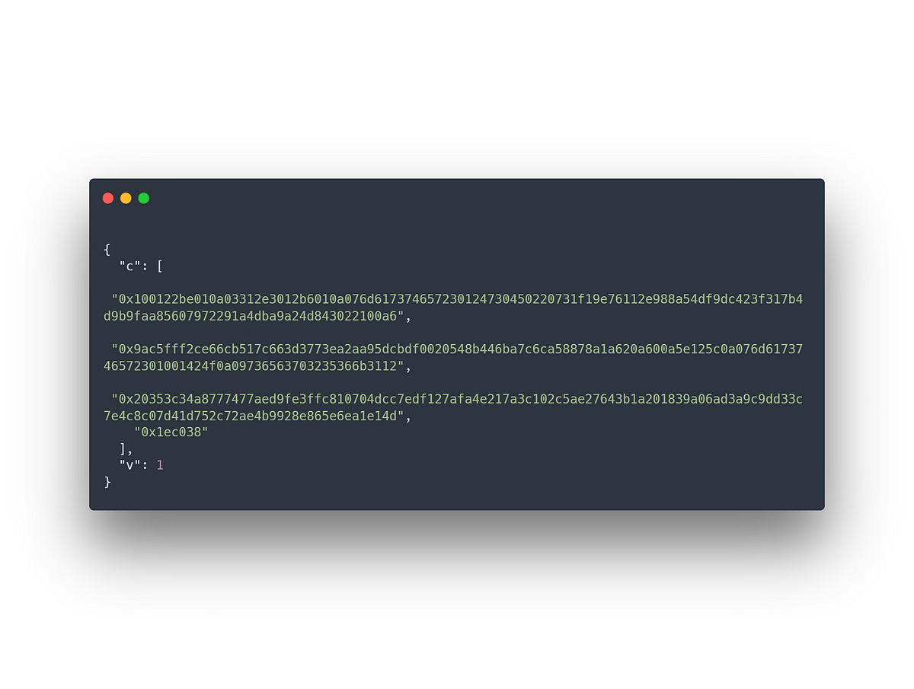
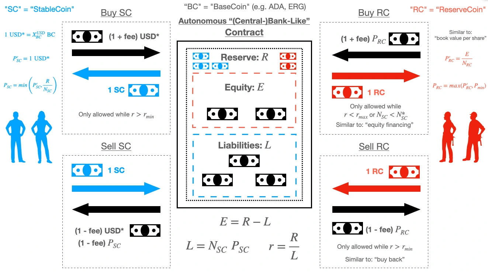

<!-- tl;dr -->
Crypto currencies don’t deserve to be called a investment.
There — I said it.

I’m sick of looking at charts, reading about median levels and „when moon“-tweets.
I think cryptocurrencies are not worthy of being called an serious investment. At least not yet.
From governments banning technolgies to quantum computing being able to crack immutability in a matter of seconds — there are a lot of factors in play which can destroy the entire ecosystem and every project in it with a fingersnap.

And because all of those factors as well as not too much adoption there’s a high volatility resulting in a high risk.

Investing — at least in my jargon — means having some sort of reliability or predictability. But the sheer amount and variety of risks is too high for me to go all in and view cryptocurrencies as a serious form of investement.

Don’t get me wrong, there are definitely many winners who took the risk, put money on the table and made a profit.

But it was a gamble after all.
And for everyone trying to predict the market while drawing a fu*king dinosaur on top of chart lines..

Really?
<!--more-->

I just can’t take that seriously.
What I can take seriously however is the underlying tech behind every crypto project.
Almost every blockchain project tries to solve real world problems. 

So why don’t we instead focus on what value the concept of a blockchain can provide?
So if you’ve been wondering what this crypto stuff really can be good for besides making a quick buck I’m here to give you some tangible examples. 

Feel free to take them the next time you’re asked about what this “pyramid scam” actually is good for.

---
*A disclaimer before we start. 
Since my pet project is Cardano, pretty much everything you’re going to read will be based around the Cardano blockchain. 
I’m sure there are many more projects, capable of achieving the same or similar use cases, I just didn’t have the time to research them.
I am explicitly not saying Cardano is the best and everything else sucks — I believe there is enough for everyone and for a plethora of blockchains to co-exist.*

---

# What is a blockchain?

First up, let me give you my view on what a blockchain can do for us.
A blockchain gives us the opportunity to acces a timestamped, immutable and auditable transparent chain of records.
As most of the blockchains run on a transnational level they are immune to (geo)political events and manipulation which is a huge upside compared to current financial systems humans use.

<!-- YT Image -->

    <a href="https://youtu.be/FKh8hjJNhWc?t=2630&si=4cow9akhTk2VpOLr">
        

        <svg class="yt-svg-play-button" fill="#ffffff" stroke="150" height="150" width="inherit" version="1.1" id="Capa_1"
                xmlns="http://www.w3.org/2000/svg" xmlns:xlink="http://www.w3.org/1999/xlink" viewBox="0 0 60 60"
                xml:space="preserve">
                <g>
                    <path
                        d="M45.563,29.174l-22-15c-0.307-0.208-0.703-0.231-1.031-0.058C22.205,14.289,22,14.629,22,15v30
                                c0,0.371,0.205,0.711,0.533,0.884C22.679,45.962,22.84,46,23,46c0.197,0,0.394-0.059,0.563-0.174l22-15
                                C45.836,30.64,46,30.331,46,30S45.836,29.36,45.563,29.174z M24,43.107V16.893L43.225,30L24,43.107z" />
                    <path d="M30,0C13.458,0,0,13.458,0,30s13.458,30,30,30s30-13.458,30-30S46.542,0,30,0z M30,58C14.561,58,2,45.439,2,30
                                S14.561,2,30,2s28,12.561,28,28S45.439,58,30,58z" />
                </g>
        </svg>
    </a>

The poorest person gets the same access to the financial system as the richest person and both of them get treated fairly.

That’s the premise and as far as we’ve seen with current projects, this is quite achievable.

Don’t quote me on this (as I have no sources) but I remember hearing that in the next few years almost two billion people from poorer countries are estimated to have their first encounter with a financial system through digital assets. So adoption will likely grow.
But apart from the monetary aspect, let’s take a look at what else can be done with cryptocurrencies and their underlying technologies.

# Digital identiy
A digital identity, or “DID” in short, is one of the most common use cases. 
The concept is having a proof of your identity while still having full control over who has access to your information. And that proof is immutable, globally accessible and can not be taken away from you unless…

For a more technichal approach let’s use a enterprise solution called <a href="https://atalaprism.io">“Atala Prism”</a> to see one possible implementation. 

Participating like any other user in the cardano network, an “Atala Prism node” is based off of the <a href="https://github.com/input-output-hk/cardano-node">regular node</a> every stake pool or Daedalus wallet uses.

Here’s a short walkthrough how it might look like if someone needs certification / a credential:

Taken from the <a href="https://www.youtube.com/watch?v=8AbgzvOeb6w">technical walkthrough video</a> a digital ID for an issuer A (e.g. a university or government) get’s created with a <a href="https://explorer.cardano-testnet.iohkdev.io/en/transaction?id=41b35ff42bd8c85aa3de8b77d4e3262ef8507a314a4fbabcbaa8468e1508c294">transaction containing specific metadata</a>.
This attached metadata is encoded and only readable by those custom built Atala nodes.
The issuer A can now generate credentials for others (for example students or citizens) by submitting another transaction, again, with the corresponding metadata.
An example can be seen in this transaction which corresponds to the transaction in the video mentioned above. 

In it the issuer A generates a credential for a holder B through a transaction.
There’s obviously not much to see apart from a encrypted, gibberish string of characters. 
But it goes to show how this piece of software ties together publicly available entries in the cardano blockchain with a more sophisticated logic running on top of it to implement a use case with high security requirements. In this example a blockchain functions as an underlying layer to add security and immutability.

A side-note: you can also batch multiple credentials into one transaction, therefore saving transaction fees and having faster transaction confirmation.

# Stable money

High volatility is one of the biggest arguments against investing in crypto.

> A boy asked his bitcoin-investing dad for 1 bitcoin for his birthday. 
> Dad: What? $15,554??? $14,354 is a lot of money! What do you need $16,782 for anyway?

A already implemented solution many other blockchains offer are so called stable coins.
Stable coins — as their name implies — are not prone to volatility but are bound to one or more defined assets such as gold or the US dollar. The promise is to have a stable cryptocurrency without the downsides of volatility.

Cardano also has such a project for a stable coin in the works. It’s called Djed.

In simple terms Djed promises to be a acurate, transparent and autonomous smart contract. You can buy or sell one (or many) stable coin for the equivalent of one USD in cryptocurrencies (for example ADA or ERG). This is represented in the left side of the picture. 
Buying a stable coin also builds up the reserve, shown in the middle.

Your one stable coin can than be sold back at anytime and you will receive one USD in the form of ADA/ERG at current market value in return. Therefore you can rest assured you will always have a digital currency, representing a specific value (in this case a USD).

To prevent the reserve going to zero, users are also incentivized to buy so called reserve coins, displayed on the right side in red. This way a little bit of game theory comes into play, rewarding users to keep the reserve safe. 

<a href="https://www.youtube.com/watch?v=zG-rxMCDIa0&t=8366s">A deeper insight can be found in the video of the Ergo Summit 2021</a>.
What’s exciting to me is that this smart contract is formally verified. Meaning the algorithm behind the stable coin is proven to be correct using <a href="https://en.wikipedia.org/wiki/Formal_methods">formal methods</a>, adding another layer of trust and security to what we are used to.

# The future might look bright

Last but not least, there is one specific video which really got me thinking more outside of the box.

There are so many possibilities. Possibilities we might not even be aware of. And this video was an eye opener of how one could or better should think of this new technology.
After all, if we would need to build a global finance system, we probably wouldn’t be doing it the way it is now but rather focus on what we are capable of with this technology at hand.

<!-- YT Image -->

    <a href="https://www.youtube.com/watch?v=yu-M2GqMdS8">
        

        <svg class="yt-svg-play-button" fill="#ffffff" stroke="150" height="150" width="inherit" version="1.1" id="Capa_1"
                xmlns="http://www.w3.org/2000/svg" xmlns:xlink="http://www.w3.org/1999/xlink" viewBox="0 0 60 60"
                xml:space="preserve">
                <g>
                    <path
                        d="M45.563,29.174l-22-15c-0.307-0.208-0.703-0.231-1.031-0.058C22.205,14.289,22,14.629,22,15v30
                                c0,0.371,0.205,0.711,0.533,0.884C22.679,45.962,22.84,46,23,46c0.197,0,0.394-0.059,0.563-0.174l22-15
                                C45.836,30.64,46,30.331,46,30S45.836,29.36,45.563,29.174z M24,43.107V16.893L43.225,30L24,43.107z" />
                    <path d="M30,0C13.458,0,0,13.458,0,30s13.458,30,30,30s30-13.458,30-30S46.542,0,30,0z M30,58C14.561,58,2,45.439,2,30
                                S14.561,2,30,2s28,12.561,28,28S45.439,58,30,58z" />
                </g>
        </svg>
    </a>

