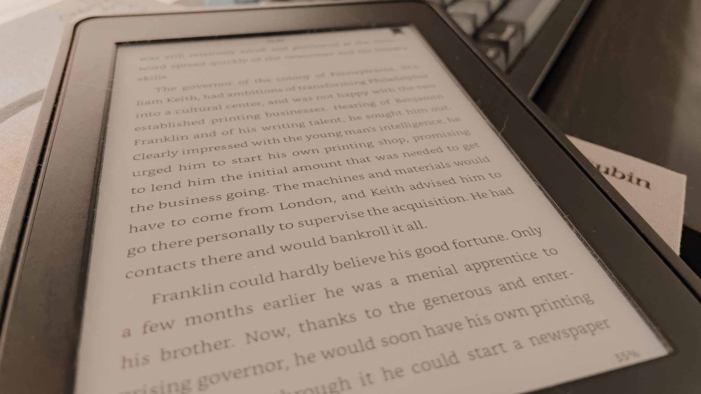
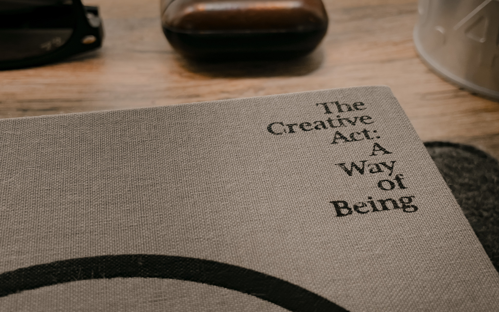

<!-- tl;dr -->
If you're like me, you know the struggle. After I've set sight on a new book for my library and hovering over the "buy" button I struggle to decide if I should get the physical or the digital / eBook variant of a book. Since I don't want to waste any more time and energy thinking and deciding I came up with a few markers to check and help me decide.
<!--more-->

Let's take a look what I value and dislike in each of the two variants. 
Of course where one shines is where the other loses so I won't specifically highlight the exact opposite but rather liste a more comprehensive overview. 

### eBooks

 
I'm not going to lie - the first time I held an eBook reader I was convinced I'm never going to touch a physical book again. Turns out I was wrong.

**Positive: note taking**

This is one of the biggest upsides eBooks. I can only speak of the Kindle version but taking notes is a breeze. Highlighting or making annotations is pretty easy. 
Also re-discovering or mergin my notes into my Knowledge Management System is super convenient. Since Kindle also has macOS native Apps I can work side by side and copy & paste and even generate digital tasks out of sparks I had while reading.

Which reminds me - I still need to check out how to automatically pull notes through the Kindle API and parse them into my Knowledge Management System.

**Positive: no lights needed**

I really like to red before going to bed. But sometimes I stay up later than my wife. With an eBook reader I'm in no need to leave the lights on and keep everybody awake just so I can read.

**Positive: internet attached**

I'm a non native speaker but I still almost exclusivey read english books. From time to time, more so in fiction, there are words I don't really know or understand. Highlighting and getting an english explanation with examples really helps me build my vocabulary.

**Negative: Re-read-ability**

I really dislike re-reading specific chapters on my Kindle.  
For me, taking out a book from your shelve, flicking through it and stopping if something sticks out is way faster and more enjoyable on physical books. I'll likely stumble over something interesting in a physical book than in a eBook.
Skipping multiple pages on an eBook reader might be okay-ish but the response time of e-ink displays isn't really on par with using paper.

**Negative: Dependency**

Once you use services like Kindle or buy which only work with specific hardware you're in what is called a "vendor lock in".  
I don't think this is too much of an issue for the majority but should be kept in mind. You probably kind of depend on a company to keep having access to your books. You can not switch devices easily or export bought books. 

This is also kind of fine by me because after I finish a book I try to squeeze as much as possible out of it. I convert all my notes and highlights to a seperate file in my note taking app, completely controlled by myself. So if the vendor fails me I can still recover with my own files or even get the physical copy.

### Physical books

Physical books started it all and make out the majority of my "collection". From Harry Potter, His Dark Materials into non-fiction from Richard Dawkins and reading non-fiction almost exclusively for the last 10+ years, physical books were my always part of my life.

**Positive: the physicality**

Pretty obvious but it's just something different to experience a book with more senses.  
To riffle through the pages while reading a chapter.  
To smell fresh ink or old paper. 
Making reading a mulit-sensory experience is so much more sastifactory than staring into a soulless device. 
Picking up an old book seeing the creases and withering I just can't stop being reminded that physical books are made to endure 

**Positive: sharing is caring**

I really like to talk about stuff I know and consumed. So chances are pretty high conversations with me head into topics I've read about. The next logical step for me - if appreciated and wanted - is to get the most fitting book and lend it for them to get the same insight I had.

**Negative: mobility**

Wether it's for holidays or on my commute - phsyical books just take up more space. Most of the time I can only take one or two books with me. Which kind of sucks if I'm working on something and gathered a lot of research. Needing multiple physical books for project kind of bind me to a certain physical space. Not something I always want.

## How I decide

The conclusion? I've came up with different markes - some maybe not really objective - but they work for me.
Here they are.

**1. Do I - at any time - want to gift or lend this book to anybody?**

If yes - there's a good chance I'll buy the physical version. Gifting a book is in itself a pretty strong indicator of how good a book is. 

**2. Do I want to look up something from time to time**

This comes directly from the re-read-ability.  
Is this a book I want or need to pick up from time to time and look something up? If yes - buying the physical version is an instant yes.
Some recent examples include books like "Built to move" or "The daily stoic".

**3. Do I like the cover?**

Listen, I'm a visual guy. You shouldn't judge a book by it's cover but if the cover's really good there's a higher chance I'll get the physical copy and put it in my book shelve. 
It gets especially hard for fiction literature.

**4. Do I want to pass on this book to my kids?**

A big dream of mine is to build an private library over time. Therefore I need to have a substantial amount of physical books as a foundation. As I kid (or even now) I would've loved to have access to books which helped my parents. 

## Conclusion

Even though I now have some help in deciding I still struggle or make the wrong decision. After finishing a book I sometimes still think to myself "Shoud've bought the other version".
But the beauty of it - if I bought a physical book - I can sell it. If I bought the eBook I can also get the physical edition on top. 
Books - at least for me - are not a luxury but an investement in myself. And yes, that counts for fiction as well as non-fiction literature.