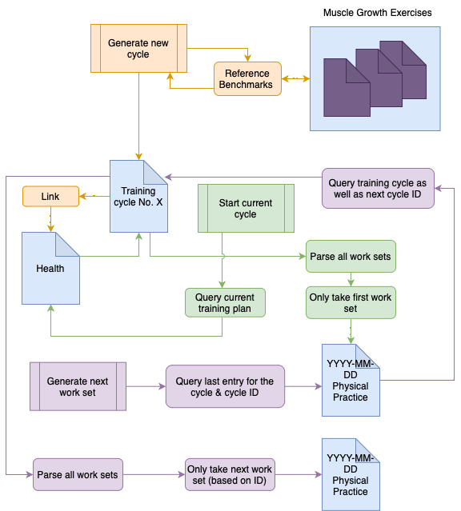
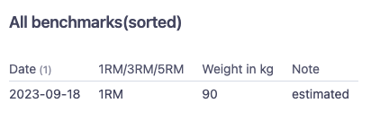
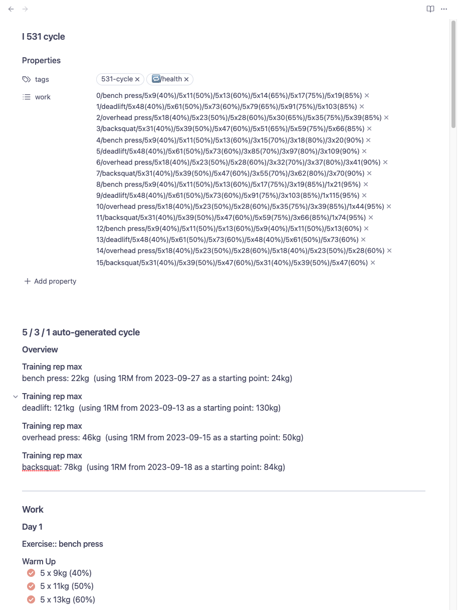

<!-- tl;dr -->
Welcome to my poor attempt to document and explain my approach on how to use Obsidian an some plugins to help me stay more active and on track with my physical training.
<!--more-->


I had the following two goals:
1. A digital system to tell me what I should train, therefore lowering the barrier to keep active.
	1. Start some kind of exercise "database" as the foundation
	2. Implement a framework which uses those exercises to tell me what to do.
   
2. A digital system to keep track of my physical practices so I can - to the best of my abilities - track and query training data to see what works and what didn't.

Since those are two very broad topics I decided to implement a MVP with the following characteristics:

- Since I strongly believe in compound exercises I started off with four main lifts, namely Backsquat, Overhead Press, Deadlift and Bench Press.
- This neatly played into a training program / framework I came to love in my early 20ies during CrossFit - the 5/3/1 by Jim Wendler. You can read up the basic at his [homepage](https://www.jimwendler.com/blogs/jimwendler-com/101065094-5-3-1-for-a-beginner).
- Tracking should be as atomic as possible - therefore it should probably based on a day to day basis.
- Actual tracking can only be established once a working prototype is done and filled with data. Therefore developing dataview queries is out of scope for the moment - although I will keep it in the back of my head and try to establish as many meaningful datapoints as possible

### Key Plugins
To automatically generate and populate any needed file I heavily relied on [templater](https://www.jimwendler.com/blogs/jimwendler-com/101065094-5-3-1-for-a-beginner) which basically let's you code JavaScript templates. For tracking and querying I use [dataview](https://github.com/blacksmithgu/obsidian-dataview). 

## A digital system to tell me what to do
Here's a quick glance at the three main functions I came up with and how they interact with the files.



I'll go over each function in detail but here's a quick overview:

1. <span style="color: #D79B00">"Generate new cycle"</span> - A template to generate training units for a pre-defined set of exercises with the percentages, sets and rep schemes according to the 5 / 3 / 1 program.
2. <span style="color: #82B366">"Start current cycle"</span> - A template to kick off the cycle. Intended to be used only once when I start a new cycle as I need to set the starting point manually.
3. <span style="color: #9673A6">"Generate next work set"</span> - Basically the same as 2. but a generic template which just generates the subsequent work set from the cycle.
 
<span style="color: #6C8EBF">Files and Output</span> - the backbone of everything. This is where I pull data from or write data into. Most notable I save outputs on a seperate file for each day.

### Muscle Growth Exercises

Before I could start with the generation of a fleshed out training plan, I needed to establish some sort of database. So starting with only four exercises became handy. But if I'm going to expand the database with different exercises I have to keep in mind to adjust all of them accordingly since the current attributes and datafields are very weightlifting oriented.

Let me show you the metadata for a generic entry which I like to call "muscle growth exercise".

Example frontmatter of the Backsquat file.

```yaml
name: backsquat
bodyCategory:
  - lower body
  - core
  - total body
bodyFocusArea:
  - quads
  - abdominals
exerciseType:
  - Resistance
  - Skill
exerciseSubType: SpeedAndExplosive
url: 
input: 
pushPull: push
doableAtHome: true
equipment:
  - barbell
  - weights
preMobility:
  - Olympic Wall Squat
  - Classic calf stretch mobilization
  - Banded super frog
postMobility: []
defaultGoal: reps
tags:
  - gpp-protocol
benchmark:
  - 2023-09-18/1RM/90/estimated
assistance:
  - Lunges
```


**preMobility**
Warming up is crucial. So I like to keep a list of useful mobilizations for the respective exercise at hand. This comes in handy later, whenever I need to actually do backsquats.

**benchmark**
Obviously you want to keep track of how much you RMs (maximum repetitions). Since Obsidian frontmatter is quite flat and does not allow nested key-value maps or arrays I chose to have a simple syntax with the following values:

1. `YYYY-MM-DD` - the date
2. How many reps did I do? `1RM`, `3RM` or `5RM` ?
3. The `weight in kg` without the unit (easier for parsing)
4. A `note`, typically if it was tested or estimated through calculations

With this syntax I can use a simple `dataviewjs` query like this to build a table to display my benchmarks.

```javascript
let pg = dv.current();
let benchmark_list = pg.benchmark
// Hacky workaround to sort by date
const sorted = benchmark_list.toSorted().reverse()

// Build the benchmark array

const benchmarkArray = [];

for (let i=0; i < sorted.length; i++){
	let row = [];
	// Date
	row.push(sorted[i].split("/", 1));
	// RM
	row.push(sorted[i].split("/", 2)[1]);
	// weight
	row.push(sorted[i].split("/", 3)[2]);
	// note
	row.push(sorted[i].split("/", 4)[3]);
	benchmarkArray.push(row);
}

dv.header(1, "All benchmarks(sorted)")
dv.table (
	// Header
	["Date", "1RM/3RM/5RM", "Weight in kg", "Note" ],
	// Data
	benchmarkArray
	.sort(k => k.date, 'desc')
)
```

This is what the query looks like.



I can obviously do more like calculate a one-rep-max I use for a cycle which specifically asks für 90% of my current 1RM etc.

A full example of my backsquat with some sample (fictional) benchmarks, as well as the 5/3/1 approximation can be found [here](https://github.com/ruttkowa/obsidian-fitness-tracking/blob/main/sampe_muscle_growth_exercise.md).

## Generating the cycle

This part is actually two parts. 
First, I need to convert the training plan from Jim Wendler's 5 / 3 / 1 program to a JavaScript template and then I needed to figure out a way to actually use it. But first things first.

The complete template can be found in my [GitHub Repository](https://github.com/ruttkowa/obsidian-fitness-tracking/blob/main/531_cycle_templater).
Since it's a huge script I'm going to break it down step by step, highlighting new stuff I found out along the way.


```javascript
// Gets the main lift pages with Dataview
const exercises = ["bench press", "deadlift", "overhead press", "backsquat"]

const exercise_hashes = []

for (let i=0; i < exercises.length; i++){
			// Exercise Array for each entry
			// Basically querys the page name, 
			// gets the benchmark metadata, 
			// sorts it to get the most current one 
			// and splits it.
			var e = DataviewAPI.page(exercises[i]).benchmark.toSorted().last().split("/", 4);
			let h = {};
			h['name'] = exercises[i];
			h['date'] = e[0];
			h['rm'] = e[1];
			h['weight'] = e[2];
			h['note'] = e[3];
			exercise_hashes.push(h);
			}
```

This is pretty self-explanatory and also the first highlight - if you have the dataview plugin installed you can use the `DataviewAPI` object to query and use all of the functions you can use in a `dataviewjs` code
block.
What happens here is nothing fancy, I define an array with the exercises I want to include and query each of those. 
While querying I only use the latest `benchmark` frontmatter attribute, splitting it according to my syntax. Each splitted value is then assigned to a hash. This hash is then pushed into the `exercise_hashes` array.
A sample hash would look like this:

```json
{
	"name": "backsquat",
	"date": "2023-10-28",
	"rm": "1RM",
	"weight": 90,
	"note": "fictional"
}
```

Since the 5 / 3 / 1 training program suggest not using your true 1RM but rather adjusted, lighter 1RMs I needed to convert my benchmarks to those training RMs.

```javascript
var cycle_rms = [];

for (let i=0; i < exercise_hashes.length; i++){
	var temp_h = {}
	let weight = parseInt(exercise_hashes[i]['weight']);
	let reps = parseInt(exercise_hashes[i]['rm'].substring(0,1));
	// Formula from 5/3/1 training template
	temp_h['trainingRM'] = Math.round((weight * reps * 0.0333 + weight) * 0.9);
	temp_h['name'] = exercise_hashes[i]['name'];
	cycle_rms.push(temp_h);
}
```

Again, pretty easy, for each hash in the array I just generated I generate a new array with the corresponding, calculated training rep-max.
After that some hardcoded percentages for the week. I chose to build a hash full of arrays full of hashes.

```javascript
// Percentages and reps
let PaR = {}
PaR['week1'] = [{"percentages": [65, 75, 85]}, {"reps": [5, 5, 5]}];
PaR['week2'] = [{"percentages": [70, 80, 90]}, {"reps": [3, 3, 3]}];
PaR['week3'] = [{"percentages": [75, 85, 95]}, {"reps": [5, 3, 1]}];
PaR['week4'] = [{"percentages": [40, 50, 60]}, {"reps": [5, 5, 5]}];
// Warm Up Sets
let warmup_percentages = [40, 50, 60]
let warmup_reps = [5, 5, 5]
```
Yes I know, don't declare uppercase variables, I'll refactor it sometime.

Now it's time to build the actual work sets (e.g. what I would do on a certain day).
I love to work with hashes because of easy to read access, so I wanted my hash for a work day to look somewhat like this.

```json
{
    "previous_id": 0,
    "id": 1,
    "exercise": "backsquat",
    "warmup_set_1": 5,
    "warmup_set_2": 5,
    "warmup_set_3": 5,
    "warmup_set_1_weights": 5,
    "warmup_set_1_percentage": 5,
    "warmup_set_2_weights": 5,
    "warmup_set_2_percentage": 5,
    "warmup_set_3_weights": 5,
    "warmup_set_3_percentage": 5,
    "set_1_reps": 5,
    "set_2_reps": 5,
    "set_3_reps": 5,
    "set_1_weight": 5,
    "set_2_weight": 5,
    "set_3_weight": 5
}
```

IDs were necessary for back-referencing which exercise should come next. But more on that later. 

```javascript
function generateTrainingDayHash(id, exercise, p, r) {
	// percentages = [65, 75, 85]
	// reps = [5, 5, 5];
	// exercise = {trainingRM: 78, name: 'backsquat'}
	console.log("Starting function generateTrainingDayHash with the following params");
	console.log(exercise);
	console.log(p);
	console.log(r);
	// Percentages and reps are an array, so I need to extract the array first
	reps = r['reps']
	percentage = p['percentages']
	var hash = {};
	hash['id'] = id;
	hash['exercise'] = exercise['name']
	console.log("Generating Warm Up Sets");
	// Warm Up
	for (let i=0; i < warmup_reps.length; i++){
		var warmupXreps = "warmup_" + (i+1) + "_reps"
		var warmupXweight = "warmup_" + (i+1) + "_weight"
		var warmupXpercentage = "warmup_" + (i+1) + "_percentage"
		hash[warmupXreps] = warmup_reps[i];
		hash[warmupXpercentage] = warmup_percentages[i];
		hash[warmupXweight] = Math.round((exercise['trainingRM'] / 100) * warmup_percentages[i]); 
	};
	console.log("Generating the actual sets, reps.length is");
	console.log(reps.length);
	// Sets = rep.length
	for (let i=0; i < reps.length; i++){
		var setXreps = "set_" + (i+1) + "_reps"
		var setXweight = "set_" + (i+1) + "_weight"
		var setXpercentage = "set_" + (i+1) + "_percentage"
		hash[setXreps] = reps[i];
		hash[setXpercentage] = percentage[i];
		hash[setXweight] = Math.round((exercise['trainingRM'] / 100) * percentage[i]); 
	};
	
	
return hash; 
}
```

This is the function which builds said hash. Note all of the `console.log` since I'm a newb at JavaScript and didn't knew what I was doing (still don't).

> Notable highlight: dynamic assignment of hash keys. 
> I didn't know JavaScript could something but you could build the string in a `for`-loop as such: `var setXreps = "set_" + (i+1) + "_reps"` which, for the first iteration, would result in the string `"set_1_reps"` for `setXreps`. I could then use this variable as the key to set the value of the key accordingly. This gives me a readable distinction between the values for each set (e.g. `hash['set_1_reps']`, `hash['set_1_weight']` and `hash['set_1_weight']` belong together).

After everything is set up, we can build everything.

```javascript
let work = []
id = 0;

for (let i=0; i < 4; i++){
	console.log("START");
	var weekIteration = "week" + (i+1);
	console.log(weekIteration);	
	for (let j=0; j < cycle_rms.length; j++){
		// Build for first, second, third and fourth exercise 
		console.log("Building for..");
		console.log(weekIteration);
		console.log(PaR[weekIteration][1]);
		console.log(PaR[weekIteration][0]);
		console.log("FUNCTION STARTS BELOW");
		work.push(generateTrainingDayHash(id, cycle_rms[j], PaR[weekIteration][0], PaR[weekIteration][1]));
		id++;
	};
};
```
 
Notable highlights are the hardcoded limit of `4` in the for loop as this represents the 4 weeks. This probably could've been made prettier / more convenient but since it's just a personal script this works perfectly fine.

So for every week we start a sub-for-loop to iterate through each exercise I included in the top and build the corresponding work for each day. 

We achieve this by calling the function from above which returns a hash which will be saved in the `work` array. The `work` array is later used in the template to display each individual day.

All of this happens in the first lines of the template. Now we define the frontmatter in the template with the standard templater syntax and outputs it into the newly generated file.

```yaml
tags: "531-cycle"
work:
<%*  
for (let i=0; i < work.length; i++){
-%>
  - <% work[i]['id'] %>/<% work[i]['exercise'] %>/<% work[i]['warmup_1_reps'] %>x<% work[i]['warmup_1_weight'] %>(<% work[i]['warmup_1_percentage'] %>%)/<% work[i]['warmup_2_reps'] %>x<% work[i]['warmup_2_weight'] %>(<% work[i]['warmup_2_percentage'] %>%)/<% work[i]['warmup_3_reps'] %>x<% work[i]['warmup_3_weight'] %>(<% work[i]['warmup_3_percentage'] %>%)/<% work[i]['set_1_reps'] %>x<% work[i]['set_1_weight'] %>(<% work[i]['set_1_percentage']%>%)/<% work[i]['set_2_reps'] %>x<% work[i]['set_2_weight'] %>(<% work[i]['set_2_percentage']%>%)/<% work[i]['set_3_reps'] %>x<% work[i]['set_3_weight'] %>(<% work[i]['set_3_percentage']%>%)
<%*  
// end work for loop
}
-%>
```

As you can see the first thing I populate is the work attribute with a complete day. Also seperated by a `/` the values are:
1. the `id` of the day
2. The exercise `name` 
3. WarmUp in the style of `RepsxWeight(Percentage)`. An example would be `1x75(90%)` which would translate to one rep of 75kg which is the equivalent of 90%. The first three sets are always the warm up sets.
4. The following last three sets are always the work sets.

I need this information as frontmatter attributes whenever I am going to generate a new training day. But more on that - you guessed it - later.

Last but not least - here is the templater code I used to iterate through each work day and display it properly.

```javascript
<%*  
for (let i=0; i < work.length; i++){
-%>
## Day <% work[i]['id'] + 1 %>
### Exercise:: <% work[i]['exercise'] %>
### Warm Up
- [ ] <% work[i]['warmup_1_reps'] %> x <% work[i]['warmup_1_weight'] %>kg (<% work[i]['warmup_1_percentage'] %>%)
- [ ] <% work[i]['warmup_2_reps'] %> x <% work[i]['warmup_2_weight'] %>kg (<% work[i]['warmup_2_percentage'] %>%)
- [ ] <% work[i]['warmup_3_reps'] %> x <% work[i]['warmup_3_weight'] %>kg (<% work[i]['warmup_3_percentage'] %>%)
### Set 1 
- [ ] <% work[i]['set_1_reps'] %> x <% work[i]['set_1_weight'] %>kg (<% work[i]['set_1_percentage']%>%)
### Set 2 
- [ ] <% work[i]['set_2_reps'] %> x <% work[i]['set_2_weight'] %>kg (<% work[i]['set_2_percentage']%>%)
### Set 3
- [ ] <% work[i]['set_3_reps'] %> x <% work[i]['set_3_weight'] %>kg (<% work[i]['set_3_percentage']%>%)

<%*  
}
-%>
```

Note that Exercise already has double colons `::` making it inline frontmatter. This is irrelevant for now but will be used later to query and track the exercises.

### Conclusion
This worked pretty well. 

Since I track my daily physical activity alongside my daily notes in a seperate file I could copy and paste the current exercise sets and reps and head to the gym. I used this iteration for four weeks in total.
But after a while I got fed up with always having to click my way through all of the links and the copy & pasting. 

So I worked out a solution for a template which automatically inserts the next work set I need to do into my daily physical practice note.

## "Just tell me what to do"

The next part was to make it even more convenient. 
I've already established a second daily note alongside my daily notes dedicated solely to what I did in terms of "physical practice" (a term I stole from Kelly Starrets book "Built to move").

The goal was to insert a template into this note which tells me what to do, based on the current cycle as well as where I am an in this specific cycle.

I came up with two distinct templates. The first is only used once at the beginning of the cycle. The second is then used for every subsequent exercise unit.

Both can be found in my GitHub Repository:
1. [Template to start the cycle](https://github.com/ruttkowa/obsidian-fitness-tracking/blob/main/start_current_cycle.md)
2. [Insert only the exercise for the day](https://github.com/ruttkowa/obsidian-fitness-tracking/blob/main/current_cycle_single.md)

Again let's go over the key differences and what they do.

### Template to start the cycle

```javascript
// Get current training plan && get the first ID ONLY

let healthpage = DataviewAPI.page("🍏 Health");
let work = DataviewAPI.page(healthpage.trainingplan.path).work[0].split("/");
```

I use the [PARA Approach](https://fortelabs.com/blog/para/) and track my current training plan (and muc more health related stuff) on a page called "🍏 Health" through inline metadata like this `Trainingplan:: [[531 cycle]]`. This gives me a convenient way to query my current plan with the `DataViewAPI` object.

Remember that I not only generated plain text output but also a custom metadata list called `work`? Let's take a closer look at that to make sense of the `.work[0].split("/");`.



As you can see a single work unit follows the following syntax:

```javascript
// Actual string for benchpress
0/bench press/5x9(40%)/5x11(50%)/5x13(60%)/5x14(65%)/5x17(75%)/5x19(85%)
```
which - after parsing is:

1. ID
2. Exercise Name
3. Warm Up 1 Reps X kg(Percentage)
4. Warm Up 2 Reps X kg(Percentage)
5. Warm Up 3 Reps X kg(Percentage)
6. Work Set 1 Reps X kg(Percentage)
7. Work Set 2 Reps X kg(Percentage)
8. Work Set 3 Reps X kg(Percentage)

Therefore running `.work[0].split("/");` returns the first item of the list and splits it into an array. 

```javascript
["0", "bench press", "5x9(40%)", "5x11(50%)", "5x13(60%)", "5x14(65%)", "5x17(75%)", "5x19(85%)"]
```

or for better readability

1. "0"
2. "bench press"
3. "5x9(40%)"
5. "5x11(50%)"
6. "5x13(60%)"
7. "5x14(65%)"
8. "5x17(75%)"
9. "5x19(85%)"]

After setting up a hash with the current ID, next ID and name of the exercise I've set up a function which parses the individual `<Set>X<Rep>(<Percentage>)` string and returns it as a hash.

```javascript
// Basic setup which is always the same
let todayswork = {};
todayswork['id'] = work[0];
todayswork['next'] = parseInt(work[0])+ 1;
todayswork['exercise'] = work[1];

// Split the individual sets to get reps, weight and percentage
function parseExercise(string) {
	// Example, starting with 5x9(40%)
	// Reps ['5', '9(40%)']
	h = {}
	h['reps'] = parseInt(string.split("x")[0]);
	// Weight ['9', '40%)']
	h['weight'] = parseInt(string.split("x")[1].split("(")[0]);
	// Percentage 
	h['percentage'] = string.split("x")[1].split("(")[1].slice(0, -1);
	return h;
};
```

Putting it all together, I iterate over the work-array from above, starting at position index 2 (because index 0 is the ID and index 1 is the name of the exercise). Needles to say, this only works for this specific syntax.

```javascript
// This only works if it's the 5/3/1 plan 
// and there are exactly 
// 3 warmup sets and 3 work sets
for (let i=2; i < work.length; i++){
	// Since we start with 2 as the index 
	// but want 2 we just substract 1 from each iteration
	var setXreps = "set_" + (i-1) + "_reps"
	var setXweight = "set_" + (i-1) + "_weight"
	var setXpercentage = "set_" + (i-1) + "_percentage"
	todayswork[setXreps] = parseExercise(work[i])['reps'];
	todayswork[setXweight] = parseExercise(work[i])['weight'];
	todayswork[setXpercentage] = parseExercise(work[i])['percentage'];
};
```

Note that I again use dynamically generated keys for the hash.
After everything is finished I should have a hash called `todayswork` to access each set and rep. 
The output of the template looks like this:

```javascript
## Todays work from the current plan: [[<% healthpage.trainingplan.path %>|<% healthpage.trainingplan.fileName() %>]]
trainingPlan::  [[<% healthpage.trainingplan.fileName() %>]]
cycleID:: <% todayswork['id'] %>
### Exercise:: <% todayswork['exercise'] %>
### Warm Up
- [ ] <% todayswork['exercise'] %>:: <% todayswork['set_1_reps'] %>x<% todayswork['set_1_weight'] %> kg (<% todayswork['set_1_percentage'] %>)
- [ ] <% todayswork['exercise'] %>:: <% todayswork['set_2_reps'] %>x<% todayswork['set_2_weight'] %> kg (<% todayswork['set_2_percentage'] %>)
- [ ] <% todayswork['exercise'] %>:: <% todayswork['set_3_reps'] %>x<% todayswork['set_3_weight'] %> kg (<% todayswork['set_3_percentage'] %>)
### Set 1 
- [ ] <% todayswork['exercise'] %>:: <% todayswork['set_4_reps'] %>x<% todayswork['set_4_weight'] %> kg (<% todayswork['set_4_percentage']%>)
### Set 2 
- [ ] <% todayswork['exercise'] %>:: <% todayswork['set_5_reps'] %>x<% todayswork['set_5_weight'] %> kg (<% todayswork['set_5_percentage']%>)
### Set 3
- [ ] <% todayswork['exercise'] %>:: <% todayswork['set_6_reps'] %>x<% todayswork['set_6_weight'] %> kg (<% todayswork['set_6_percentage']%>) <% todayswork['exercise'].replace(/\s/g, "") %>ExtraReps::
```

Although I won't cover tracking it's worth noting that I try to track the extra reps of each last set in the form of `<exerciseName>ExtraReps::` so for backsquats it would be `backsquatsExtraReps::` and so forth. 

One caveat still - there are exercises which feature a whitespace such as "overhead press". 
And since `overhead pressExtraReps::` would not register as `"overhead pressExtraReps"` metadata as intended but rather only as `pressExtraReps` I added the `.replace(/\s/g, "")` to this string to strip it of all whitespaces.

## Key takeaways

In conclusion, here are my main takeaways from this little project:

1. Use the developer tools. I relied heavily on them, cross referencing functions and running my scripts. Obsidian Developer Tools on a Mac can be accessed with Command (⌘) + Option (⌥) + i
2. If you want to use dataview in a non `dataview` declared code block or in conjunction with templater JavaScript simply use the `DataviewAPI` object instead of the `dv.` object like you're used to. That way you can query pages and work with them and the metadata
3. Use camelCase for metadata. Parsing Metadata with underscores or other seperators sometimes didn't work - therefore I switched to camelCase completely.
4. Since Obsidian metadata can't be nested (yet?) you can implement a workaround with parseable syntax. First thing you need to do is to define the delimiter (and make sure this delimiter doesn't show up in any potential values) and the second thing is to document the syntax. For some code might be enough documentation but I'd rather have a nice readme.
5. Try to treat files with metadata more like database entries and think hard about which values you track with metadata. Sticking to [database normalization](https://en.wikipedia.org/wiki/Database_normalization)helped me a lot (although it obviously cant be applied 100%).
6. Developing in Obsidian without using git sucks. I need to do some research if there are more convenient and traditional software development ways which also translate well into Obsidian.