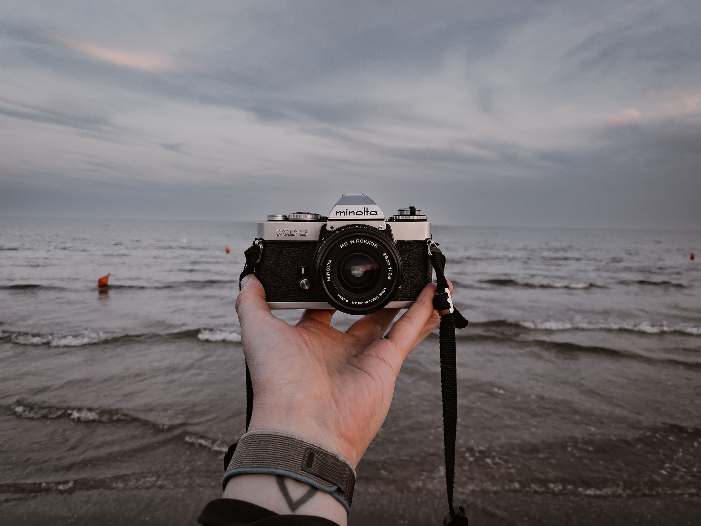

Analog choices have more consequences than digital ones. Whether it’s photography or writing something down, I’ve noticed that I tend to commit more to the thing I am creating if If I chose an analog instead of digital medium.
In this post I want to explore my new found passion for analog.
<!--more-->

### Why analog?

I have more agency over the things I create. 
I really own it. 
I am not dependent on (yet another) cloud service to access what is mine. 

There is no subscription model. 
No risk of being cut off of what I’ve built if a company changes their terms of use, ownership or goes bankrupt. Paper does not need a battery. Printed photos do not depend on network coverage to be seen.

Everything I need to be creative is in my possesion on my desk.
I can access it instantly. 

Flicking through a physical book and reading back and forth in a chapter will always beat using an eBook reader.
Experiencing my work coming alive feels much more effortles to me with actual pen and paper.

Digital distractions will be eliminated automatically if I focus exclusively on the actual physical things that I need. 

No need to put my phone into "do not disturb" mode if it's not on the the table. Out of sight, out of mind.

And at the end of the day, I have tangible proof of my work. 
Sharing photos with friends by actually giving instead of sending. Building real human to human connection without a service in between.

Having a conversation, talking about my thoughts, errors and learnings.

Because a once printed, a photo cannot be post-processed anymore. 

A line of ink cannot be undone.
There's no strg / cmd + z.  

It is so satisfying to flip through those pocket notebooks and look back on the notes, the „To-Dos“ and the sketches to see my progression.
I love to see my bookshelf grow over time with new books and notebooks. It's better than any CV. 

This is my portfolio. 

This is proof of me. 

Living.

From now on I try to use my digital products more deliberate. 
They are tools and should be treated as such. Something I need to understand completely and use only if necessary.

Otherwise - I want to deliberately choose the harder way, go that extra mile.

To get that *good* dopamine. 

Because analog over digital gives me a deeper connection with the things I do.